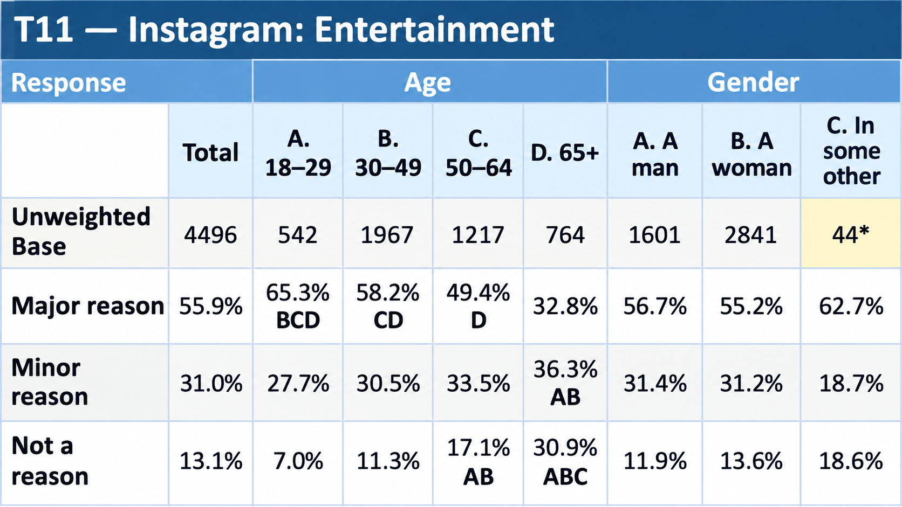

# Social Media Platform Usage & User Motivations

Independent survey-tabulation portfolio project using Pew Research Center American Trends Panel Wave 144 public-use data. The project converts routed survey microdata into 28 weighted cross-tabulations covering four social platforms and five demographic banners, with significance testing, automated QA, and a formatted Excel tab book.

> This is an independent portfolio analysis, not an official Pew Research Center analysis. Platform results describe different platform-specific or routed respondent universes, so cross-platform comparisons are descriptive.

## Final Tab Book Preview



*Representative view of the final weighted Excel tab book, showing demographic banners, unweighted bases, weighted percentages, significance letters, and small-base notation.*

## Quick Access

- **[Open the Final Excel Tab Book](output/tab_books/Reach3_Social_Media_TabBook.xlsx)** — 28 weighted cross-tabulations with demographic banners, significance letters, and small-base flags
- **[Portfolio Case Study (PDF)](output/reports/Social_Media_Survey_Tabulation_Case_Study.pdf)** — concise project overview, findings, methodology, and QA
- **[Read the Methodology](documentation/methodology.md)** — analytical universes, weighting, effective bases, significance testing, and QA
- **[Follow the Technical Workflow](documentation/workflow.md)** — six-stage pipeline, run instructions, output structure, and implementation QA
- **[Review the Tabulation Plan](tabulation/tabulation_plan.csv)** — table-level outcomes, universes, weights, banners, and display specifications
- **[Review the Variable-Selection Matrix](tabulation/variable_selection_matrix.csv)** — source-variable inventory and documented analytical selection decisions
- **[Inspect the Final Tables](output/tables/)** — persisted CSV outputs for T01–T28
- **QA outputs:** [Summary](qa/qa_summary.csv) · [Effective Bases](qa/effective_bases.csv) · [Significance Tests](qa/significance_test_results.csv) · [Small-Base Review](qa/small_base_qa.csv)

## Research Question

How do social-media usage motivations differ across Facebook, Instagram, X, and TikTok, and across demographic groups?

Platform profiles are compared descriptively because they use different platform-specific or routed respondent universes. Statistical testing is performed across demographic categories within a platform, not as a formal cross-platform test.

## Key Findings

- On Facebook, 74.8% selected keeping up with friends and family as a major reason for using the platform.
- On TikTok, 81.4% selected entertainment as a major reason.
- On X, entertainment led at 44.8%, while shared interests, sports/pop culture, news, and politics formed a descriptive cluster between 24.3% and 28.3%.
- On Instagram, entertainment was a major reason for 65.3% of users ages 18–29 versus 32.8% of users ages 65+; this within-platform difference was statistically significant.
- On Facebook, friends and family was a major reason for 80.2% of women versus 67.6% of men; this within-platform difference was statistically significant.

Platform-level percentages describe different platform-specific or routed respondent universes, so comparisons across platforms are descriptive. Significance testing applies to demographic comparisons within a platform.

## Methodology at a Glance

```text
Questionnaire → Initial Screening → Routing & Universe Validation
→ Variable Selection → Weighted Cross-Tabs → Effective Bases
→ Significance Testing → Independent QA → Excel Tab Book
```

Platform-specific analytical universes and survey weights are applied before tabulation. The workflow then calculates weighted cross-tabs and effective bases, performs within-platform demographic significance testing, independently reconciles persisted outputs, and generates the final Excel tab book.

## Initial Screening & Variable Selection

Variable selection followed a documented screening process rather than an arbitrary selection of interesting columns. The 195-variable W144 source file was inventoried, and candidate analytical fields were assessed against the questionnaire structure, routing logic, platform-specific analytical universes, response coding, availability and validity of the appropriate survey weights, relevance to the research question, demographic banner design, and documented inclusion or exclusion decisions.

The final analytical scope contains:

- **28 platform-specific WHY variables:** seven target motivations for each of Facebook, Instagram, X, and TikTok
- **Five primary demographic banners:** Age, Gender, Education, Census Region, and Income
- **Four platform-specific analytical universes:** defined from questionnaire routing
- **Four platform-specific weights:** matched to the corresponding analytical universe

The 28 WHY variables were retained because they measure the seven target motivations consistently across the four platforms: news, politics or political issues, sports or pop culture, entertainment, friends and family, shared interests, and product reviews or recommendations. Substantive response codes `1`, `2`, and `3` were validated before tabulation; special code `99` is retained for QA but excluded from percentage denominators.

The five primary banners were selected to provide focused and interpretable subgroup comparisons. The selection matrix explicitly excludes metro status and more detailed education and income alternatives from the primary banner specification. These alternatives were not retained in the final primary banner set.

Platform-specific universes and weights were defined from questionnaire routing and survey documentation rather than inferred arbitrarily from observed responses:

| Platform | Analytical universe | Survey weight |
|---|---|---|
| Facebook | `DOV_ASKFB_W144 == 1` | `WEIGHT_W144_FB` |
| Instagram | `DOV_ASKIG_W144 == 1` | `WEIGHT_W144_IG` |
| X | `SMUSE_c_W144 == 1` | `WEIGHT_W144_XT` |
| TikTok | `SMUSE_i_W144 == 1` | `WEIGHT_W144_TT` |

Facebook and Instagram required additional routed-module validation. Before tabulation, the pipeline programmatically reconstructed expected module eligibility from platform use and the Facebook/Instagram assignment variable, then reconciled those results with the supplied derived routing fields. All 28 WHY variables were checked for responses outside their eligible universe and missing responses inside the universe. Analytical weights were checked for missing, nonnumeric, nonfinite, and nonpositive values.

The [variable-selection matrix](tabulation/variable_selection_matrix.csv) inventories the source variables and records explicit final decisions for the selected analytical outcomes and evaluated banner candidates; it does not imply that every source variable received a formal `INCLUDE` or `EXCLUDE` disposition. The [tabulation plan](tabulation/tabulation_plan.csv) defines the final relationship between each outcome, universe, weight, banner set, display rule, and QA requirement.

## Data Sources

- [Pew Research Center — American Trends Panel Wave 144 public-use dataset](https://www.pewresearch.org/dataset/american-trends-panel-wave-144/)
- [Pew Research Center — Wave 144 questionnaire and topline](https://www.pewresearch.org/wp-content/uploads/sites/20/2024/06/PI_2024.06.12_Politics-Across-Platforms_TOPLINE.pdf)
- [Pew Research Center — Wave 144 survey methodology](https://www.pewresearch.org/2024/06/12/politics-across-platforms-methodology/)
- [Pew Research Center — How Americans Navigate Politics on TikTok, X, Facebook and Instagram](https://www.pewresearch.org/internet/2024/06/12/how-americans-navigate-politics-on-tiktok-x-facebook-and-instagram/)

The raw public-use microdata are not redistributed in this repository. To reproduce the project, obtain W144 from the official Pew Research Center source and place the CSV at:

```text
data/raw/ATP_W144.csv
```

The analytic file contains 10,454 records: 10,287 survey respondents plus demographic and profile records for 167 active panel members who did not use the internet, consistent with the documented W144 methodology.

## Project Highlights

| Metric | Result |
|---|---:|
| Analytic-file records | 10,454 |
| Survey respondents | 10,287 |
| Raw variables | 195 |
| Social platforms | 4 |
| Motivation variables | 28 |
| Primary demographic banners | 5 |
| Cross-tab tables | 28 |
| Analytical columns per table | 18 |
| Percentage-sum QA checks | 504 |
| Persisted weighted percentages independently reconciled | 1,512 |
| Banner cells screened for base size | 476 |
| Pairwise significance tests | 1,596 |
| Significant comparisons under the project testing procedure | 495 |
| Cells receiving significance markers | 342 |
| Low-base categories entering significance tests | 0 |

## Tech Stack

**Python 3.11 · pandas · NumPy · openpyxl · CSV · Excel · Git/GitHub**

## Important Interpretation

Weighted percentages use the platform-specific survey weights and analytical universes defined in the tabulation plan. Facebook and Instagram use routed module universes, while X and TikTok use their respective platform-user universes; cross-platform comparisons are therefore descriptive. Demographic significance testing is performed within a platform.

Significance tests use weighted estimates and Kish-adjusted effective sample sizes. Categories with unweighted bases below 100 are excluded, and no multiplicity adjustment is applied. Results are exploratory and do not reproduce Pew Research Center's complete complex-survey variance-estimation procedure.

## Technical Documentation

[Methodology](documentation/methodology.md) ·
[Technical Workflow](documentation/workflow.md) ·
[Tabulation Plan](tabulation/tabulation_plan.csv) ·
[Variable-Selection Matrix](tabulation/variable_selection_matrix.csv) ·
[QA Summary](qa/qa_summary.csv) ·
[Effective Bases](qa/effective_bases.csv) ·
[Significance Tests](qa/significance_test_results.csv) ·
[Small-Base Review](qa/small_base_qa.csv)

## Contact

[LinkedIn](https://www.linkedin.com/in/carloshenriquenakagomi/) · [Email](mailto:carlosnakagomi@gmail.com)
